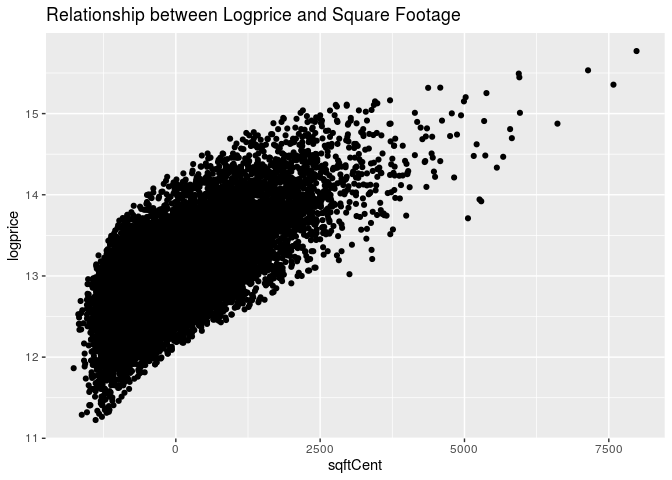

HW 03: Multiple Linear Regression
================
Hannah Wang
2019 October 2

``` r
library(tidyverse)
library(broom)
library(knitr) 
```

``` r
# for Question 8
houses <- read_csv("data/KingCountyHouses.csv")
```

### Question 1

speed-hat = 52.387 + 0.020 \* year - 0.0032 \* starters - 1.070 \* good
-2.1834 \* slow + 0.012 \* (year x good) + 0.012 \* (year x slow)

### Question 2

For slow track conditions:

speed-hat = 52.387 + 0.020 \* year - 0.0032 \* starters - 1.070 \* 0 -
2.1834 \* 1 + 0.012 \* (year x 0) + 0.012 \* (year x 1)

\= 50.2036 + 0.032 \* year - 0.0032 \* starters

### Question 3

The intercept (52.387 feet per second) describes the average speed for a
winner in the year 1896, with a fast track condition, and racing with 0
horses. The intercept is not meaningful because it does not make sense
for the winner to race against 0 horses.

### Question 4

The p-value is 0.013. We use the p-value in the conditiongood variable
row because that is the p-value we get from comparing good track
conditions to the baseline condition of fast track. Since year = 0, we
don’t have to worry about the interaction variables.

### Question 5

All other variables held constant, the winner’s speed is predicted, on
average, to be 2.183 feet per second lower on a slow track than on a
fast track.

### Question 6

The p-value is 0.113. We use the p-value in the year:conditiongood
interaction variable row.

### Question 7

``` r
qt(0.975, 115)
```

    ## [1] 1.980808

CI = slope of year for slow track ± t\* SE(slope of year for slow track)

CI = 0.012 ± 0.004 t\*

``` r
0.012 + 0.004 * 1.980808
```

    ## [1] 0.01992323

``` r
0.012 - 0.004 * 1.980808
```

    ## [1] 0.004076768

We are 95% confident that the true difference between the slope of year
for slow track conditions and the slope of year for fast track
conditions lies between 0.00407 and 0.1992. In other words, we are 95%
confident that for a one year increase, the winner’s speed on a slow
track is expected to increase, on average, by 0.004 to 0.020 feet per
second more than the winner’s speed on a fast track.

### Question 8

#### Introduction

``` r
houses <- houses %>%
  filter(bedrooms <= 5 ) %>%
  mutate(floorsCat = as.factor(floors), 
         sqftCent = sqft - mean(sqft), 
         bedroomsCent = bedrooms - mean(bedrooms),
         bathroomsCent = bathrooms-mean(bathrooms),
         logprice = log(price))
```

Fit a regression model between logprice and predictor
variables:

``` r
logprice_model <- lm(logprice ~ floorsCat + sqftCent + bedroomsCent + bathroomsCent + waterfront, data = houses)
kable(tidy(logprice_model, conf.int = TRUE, level = 0.95),digits=3)
```

| term          | estimate | std.error | statistic | p.value | conf.low | conf.high |
| :------------ | -------: | --------: | --------: | ------: | -------: | --------: |
| (Intercept)   |   13.015 |     0.004 |  3385.246 |   0.000 |   13.007 |    13.022 |
| floorsCat1.5  |    0.184 |     0.009 |    19.905 |   0.000 |    0.166 |     0.202 |
| floorsCat2    |  \-0.002 |     0.006 |   \-0.299 |   0.765 |  \-0.015 |     0.011 |
| floorsCat2.5  |    0.206 |     0.031 |     6.653 |   0.000 |    0.146 |     0.267 |
| floorsCat3    |    0.214 |     0.016 |    13.515 |   0.000 |    0.183 |     0.245 |
| floorsCat3.5  |    0.273 |     0.138 |     1.976 |   0.048 |    0.002 |     0.543 |
| sqftCent      |    0.000 |     0.000 |    86.944 |   0.000 |    0.000 |     0.000 |
| bedroomsCent  |  \-0.062 |     0.004 |  \-16.115 |   0.000 |  \-0.069 |   \-0.054 |
| bathroomsCent |    0.061 |     0.006 |    10.742 |   0.000 |    0.050 |     0.072 |
| waterfront    |    0.567 |     0.029 |    19.313 |   0.000 |    0.509 |     0.624 |

logprice-hat = 13.015 + 0.184 \* floorsCat1.5 - 0.002 \* floorsCat2 +
0.206 \* floorsCat2.5 + 0.214 \* floorsCat3 + 0.273 \* floorsCat3.5 +
0.000 \* sqftCent - 0.062 \* bedroomsCent + 0.061 \* bathroomsCent +
0.567 \*
waterfront

``` r
ggplot(data = houses, mapping = aes(x = price)) + geom_histogram() + labs(title = "Distribution of Price for Houses Sold in King County, Washington")
```

<!-- -->

The distribution of house prices is unimodal and strongly right skewed
due to high outliers of houses that are extremely expensive. Thus, we
visualize the distribution of the log transformed house
prices.

``` r
ggplot(data = houses, mapping = aes(x = logprice)) + geom_histogram() + labs(title = "Distribution of Logprice for Houses Sold in King County, Washington")
```

<!-- -->

The distribution of logprice is unimodal and relatively normal. We use
the log-transformed version of price because it gives us a more normal
distribution that is more spread out and easier to analyze, as opposed
to the clustered and extremely right skewed distribution of price, due
to the high outliers.

Created a scatterplot to visualize the relationship between logprice and
square
footage:

``` r
ggplot(data = houses, mapping = aes(x = sqftCent, y = logprice)) + geom_point() + labs(title = "Relationship between Logprice and Square Footage")
```

<!-- -->

There is a strong positive correlation between a house’s logprice and
square footage.

#### MAYBE USE

``` r
houses <- houses %>%
  mutate(resid = residuals(logprice_model))
```

``` r
ggplot(data = houses, mapping = aes(x = sqftCent, y = resid)) + geom_point()
```

<!-- -->

### Overall (do not delete\!)
