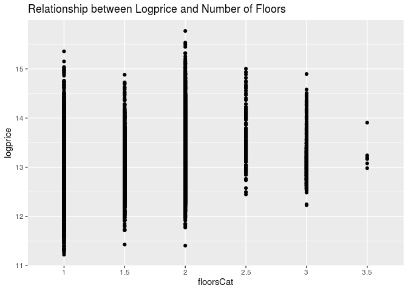

HW 03: Multiple Linear Regression
================
Hannah Wang
2019 October 2

``` r
library(tidyverse)
library(broom)
library(knitr) 
```

``` r
# for Question 8
houses <- read_csv("data/KingCountyHouses.csv")
```

### Question 1

For fast track conditions:

speed-hat = 52.387 + 0.020 \* year - 0.003 \* starters

### Question 2

For slow track conditions:

speed-hat = 52.387 + 0.020 \* year - 0.003 \* starters - 1.070 \* 0 -
2.1834 \* 1 + 0.012 \* (year x 0) + 0.012 \* (year x 1)

\= 50.2036 + 0.032 \* year - 0.003 \* starters

### Question 3

The intercept (52.387 feet per second) describes the average speed for a
winner in the year 1896, with a fast track condition, and racing with 0
horses. The intercept is not meaningful because it does not make sense
for the winner to race against 0 horses.

### Question 4

The p-value is 0.013. We use the p-value in the conditiongood variable
row because that is the p-value we get from comparing good track
conditions to the baseline condition of fast track. Since year = 0, we
don’t have to worry about the interaction variables.

### Question 5

All other variables held constant, the winner’s speed is predicted, on
average, to be 2.183 feet per second lower on a slow track than on a
fast track.

### Question 6

The p-value is 0.113. We use the p-value in the year:conditiongood
interaction variable row.

### Question 7

``` r
qt(0.975, 115)
```

    ## [1] 1.980808

CI = slope of year for slow track ± t\* SE(slope of year for slow track)

CI = 0.012 ± 0.004 t\*

``` r
0.012 - 0.004 * 1.980808
```

    ## [1] 0.004076768

``` r
0.012 + 0.004 * 1.980808
```

    ## [1] 0.01992323

We are 95% confident that the true difference between the slope of year
for slow track conditions and the slope of year for fast track
conditions lies between 0.00407 and 0.1992. In other words, we are 95%
confident that for a one year increase, the winner’s speed on a slow
track is expected to increase, on average, by 0.004 to 0.020 feet per
second more than the winner’s speed on a fast track.

### Question 8

#### Introduction

``` r
houses <- houses %>%
  filter(bedrooms <= 5 ) %>%
  mutate(floorsCat = as.factor(floors), 
         sqftCent = sqft - mean(sqft), 
         bedroomsCent = bedrooms - mean(bedrooms),
         bathroomsCent = bathrooms-mean(bathrooms),
         logprice = log(price))
```

#### Regression Model

Fit a regression model between logprice and predictor
variables:

``` r
logprice_model <- lm(logprice ~ floorsCat + sqftCent + bedroomsCent + bathroomsCent + waterfront, data = houses)
kable(tidy(logprice_model, conf.int = TRUE, level = 0.95),digits=5)
```

| term          |  estimate | std.error |  statistic | p.value |  conf.low | conf.high |
| :------------ | --------: | --------: | ---------: | ------: | --------: | --------: |
| (Intercept)   |  13.01451 |   0.00384 | 3385.24619 | 0.00000 |  13.00697 |  13.02204 |
| floorsCat1.5  |   0.18368 |   0.00923 |   19.90500 | 0.00000 |   0.16559 |   0.20176 |
| floorsCat2    | \-0.00192 |   0.00644 |  \-0.29872 | 0.76515 | \-0.01454 |   0.01070 |
| floorsCat2.5  |   0.20645 |   0.03103 |    6.65257 | 0.00000 |   0.14562 |   0.26727 |
| floorsCat3    |   0.21371 |   0.01581 |   13.51549 | 0.00000 |   0.18272 |   0.24470 |
| floorsCat3.5  |   0.27272 |   0.13805 |    1.97552 | 0.04822 |   0.00213 |   0.54331 |
| sqftCent      |   0.00040 |   0.00000 |   86.94443 | 0.00000 |   0.00039 |   0.00041 |
| bedroomsCent  | \-0.06172 |   0.00383 | \-16.11498 | 0.00000 | \-0.06923 | \-0.05421 |
| bathroomsCent |   0.06067 |   0.00565 |   10.74194 | 0.00000 |   0.04960 |   0.07174 |
| waterfront    |   0.56684 |   0.02935 |   19.31321 | 0.00000 |   0.50931 |   0.62437 |

logprice-hat = 13.015 + 0.184 \* floorsCat1.5 - 0.002 \* floorsCat2 +
0.206 \* floorsCat2.5 + 0.214 \* floorsCat3 + 0.273 \* floorsCat3.5 +
0.0004 \* sqftCent - 0.062 \* bedroomsCent + 0.061 \* bathroomsCent +
0.567 \*
waterfront

#### Exploratory Data Analysis

``` r
ggplot(data = houses, mapping = aes(x = price)) + geom_histogram() + labs(title = "Distribution of Price for Houses Sold in King County, Washington")
```

<!-- -->

The distribution of house prices is unimodal and strongly right skewed
due to high outliers of houses that are extremely expensive. Thus, we
visualize the distribution using the log transformed house
prices.

``` r
ggplot(data = houses, mapping = aes(x = logprice)) + geom_histogram() + labs(title = "Distribution of Logprice for Houses Sold in King County, Washington")
```

<!-- -->

The distribution of logprice is unimodal and relatively normal. We use
the log-transformed version of price because it gives us a more normal
distribution that is more spread out and easier to analyze, as opposed
to the clustered and extremely right skewed distribution of price, due
to the high outliers from very expensive houses.

Created scatterplots to visualize the relationship between logprice and
predictor
variables:

``` r
pairs(logprice ~ floorsCat + sqftCent + bedroomsCent + bathroomsCent + waterfront, data = houses, lower.panel = NULL)
```

<!-- -->

#### Discussion

Relationship between House Price and Square Footage:

For every 1 square foot increase in a house’s interior square footage,
we expect the median price to be multiplied by a factor of $1.0004. We
are 95% confident that for a 1 square foot increase in a house’s
interior square footage, we can expect the median price to be multiplied
by a factor of 1.00039 to 1.00041.

Relationship between House Price and Number of Floors:

A house with 1.5 floors is expected to have a median price 1.202 times
the price of a 1-floor house. A house with 2 floors is expected to have
a median price 0.998 times the price of a 1-floor house. A house with
2.5 floors is expected to have a median price 1.229 times the price of a
1-floor house. A house with 3 floors is expected to have a median price
1.238 times the price of a 1-floor house. A house with 3.5 floors is
expected to have a median price 1.314 times the price of a 1-floor
house.

The null hypothesis states that there is no statistically significant
difference in house price between houses with 1 floor and 1.5, 2, 2.5,
3, and 3.5 floors. The alternative hypothesis states that there is a
statistically significant difference in house prices between houses with
different number of floors.

The differences in house price are statistically significant for all
floors except between houses with 1 floor and 2 floors. This is because
the p-value for 2 floor houses is 0.765, which is greater than the alpha
level of 0.05, thus we fail to reject the null hypothesis, showing there
is no statisically significant difference in house price betwen houses
with 1 and 2
floors.

#### Assumptions

``` r
ggplot(data = houses, mapping = aes(x = floorsCat, y = logprice)) + geom_point() + labs(title = "Relationship between Logprice and Number of Floors")
```

<!-- -->

``` r
ggplot(data = houses, mapping = aes(x = sqftCent, y = logprice)) + geom_point() + labs(title = "Relationship between Logprice and Square Footage")
```

<!-- -->

``` r
ggplot(data = houses, mapping = aes(x = bedroomsCent, y = logprice)) + geom_point() + labs(title = "Relationship between Logprice and Number of Bedrooms")
```

<!-- -->

``` r
ggplot(data = houses, mapping = aes(x = bathroomsCent, y = logprice)) + geom_point() + labs(title = "Relationship between Logprice and Number of Bathrooms")
```

<!-- -->

``` r
ggplot(data = houses, mapping = aes(x = waterfront, y = logprice)) + geom_point() + labs(title = "Relationship between Logprice and Waterfont")
```

<!-- -->

``` r
houses <- houses %>%
  mutate(predicted = predict.lm(logprice_model), resid = residuals(logprice_model))
```

``` r
ggplot(data = houses, mapping = aes(x = resid)) + geom_histogram() + labs(title = "Distribution of Residuals")
```

<!-- -->

``` r
ggplot(data = houses, mapping = aes(x = predicted, y = resid)) + geom_point() + geom_hline(yintercept = 0, color ="red") + labs(title = "Residual Plot of Logprice Residuals vs. Predicted Logprice")
```

<!-- -->

``` r
ggplot(data = houses, mapping = aes(x = floorsCat, y = resid)) + geom_point() + geom_hline(yintercept = 0, color ="red") + labs(title = "Residual Plot of Logprice Residuals vs. Number of Floors")
```

<!-- -->

``` r
ggplot(data = houses, mapping = aes(x = sqftCent, y = resid)) + geom_point() + geom_hline(yintercept = 0, color ="red") + labs(title = "Residual Plot of Logprice Residuals vs. Interior Square Footage")
```

<!-- -->

``` r
ggplot(data = houses, mapping = aes(x = bedroomsCent, y = resid)) + geom_point() + geom_hline(yintercept = 0, color ="red") + labs(title = "Residual Plot of Logprice Residuals vs. Number of Bedrooms")
```

<!-- -->

``` r
ggplot(data = houses, mapping = aes(x = bathroomsCent, y = resid)) + geom_point() + geom_hline(yintercept = 0, color ="red") + labs(title = "Residual Plot of Logprice Residuals vs. Number of Bathrooms")
```

<!-- -->

``` r
ggplot(data = houses, mapping = aes(x = waterfront, y = resid)) + geom_point() + geom_hline(yintercept = 0, color ="red") + labs(title = "Residual Plot of Logprice Residuals vs. Waterfront")
```

<!-- -->

``` r
ggplot(data = houses, mapping = aes(sample = resid)) + 
  stat_qq() + 
  stat_qq_line() +
  labs(title = "Normal QQ Plot of Residuals")
```

<!-- -->

Linearity is satisfied for all predictor variables except number of
floors because the scatterplots for the other variables show relatively
positive correlations with logprice that follow a linear relationship,
but the scatterplot between logprice and number of floors does not show
a linear relationship.

Normality is satisfied because the distribution of residuals for the
logprice model is normal and the normal qq plot of residuals follows the
line of best fit.

Constant Variance is not satsified for any of the predictor variables
because the the variation in residuals are not constant across any of
the predictor variables.

Independence is not satisfied because a house’s price is not completely
indpendent of other houses’ prices. For example, if the economy is not
doing well, house prices might decrease in general, or houses might be
priced lower to compete in the market. Also, houses in the same
neighborhood might all be priced
similarly.

#### Interaction

``` r
logprice_model <- lm(logprice ~ floorsCat + sqftCent + bedroomsCent + bathroomsCent + waterfront + waterfront * bedroomsCent, data = houses)
kable(tidy(logprice_model, conf.int = TRUE, level = 0.95),digits=5)
```

| term                    |  estimate | std.error |  statistic | p.value |  conf.low | conf.high |
| :---------------------- | --------: | --------: | ---------: | ------: | --------: | --------: |
| (Intercept)             |  13.01447 |   0.00384 | 3384.88701 | 0.00000 |  13.00693 |  13.02201 |
| floorsCat1.5            |   0.18373 |   0.00923 |   19.91015 | 0.00000 |   0.16564 |   0.20182 |
| floorsCat2              | \-0.00184 |   0.00644 |  \-0.28568 | 0.77513 | \-0.01446 |   0.01078 |
| floorsCat2.5            |   0.20670 |   0.03104 |    6.66015 | 0.00000 |   0.14587 |   0.26753 |
| floorsCat3              |   0.21361 |   0.01581 |   13.50832 | 0.00000 |   0.18261 |   0.24460 |
| floorsCat3.5            |   0.27256 |   0.13805 |    1.97428 | 0.04836 |   0.00196 |   0.54315 |
| sqftCent                |   0.00040 |   0.00000 |   86.87878 | 0.00000 |   0.00039 |   0.00041 |
| bedroomsCent            | \-0.06189 |   0.00384 | \-16.12661 | 0.00000 | \-0.06941 | \-0.05437 |
| bathroomsCent           |   0.06066 |   0.00565 |   10.74138 | 0.00000 |   0.04959 |   0.07173 |
| waterfront              |   0.56878 |   0.02948 |   19.29264 | 0.00000 |   0.51099 |   0.62656 |
| bedroomsCent:waterfront |   0.02033 |   0.02918 |    0.69677 | 0.48595 | \-0.03686 |   0.07752 |

The interaction between `waterfront` and `bedroomsCent` is not
significant because the p-value is 0.486, which is higher than the alpha
level of 0.05.

### Overall (do not delete\!)
